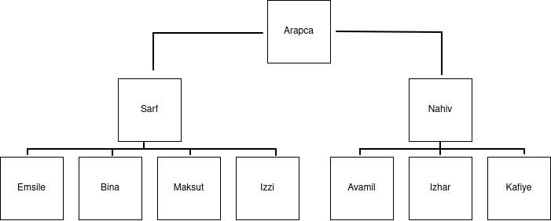

# Arapca

`Sarf` ve `Nahiv` olarak ikiye ayrilir.

- Sarf, kelime ilmidir.
- Nahiv, sarf ilmini ogrendikten sonra bu kelimelerle cumle kurabilmeyi ogreten ilimdir.

## Sarf

Sarf 4 kitapta ogrenilir.

1. Emsile
2. Bina
3. Maksud
4. Izzi

## Nahif

Nahiv 3 kitapta ogrenilir

1. Avamil
2. Izhar
3. Kafiye

## Ders Takibi

Yillardir binlerce alim yetistirmis Osmanli medrese sisteminde ilk once `Sarf` daha sonra `Nahiv` ogrenilir. Biz de insallah bu sira ile gidecegiz.
