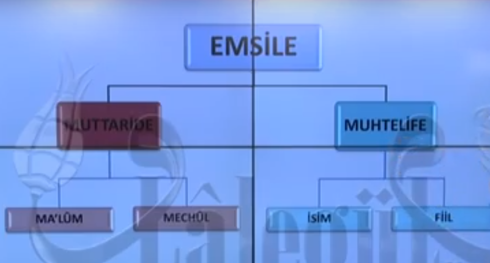

# 1. Ders

## Emsile Kitabi

`Emsile` kitabi `sarf` ilminin ilk kitabidir. Bu kitap bize arapca kelime kaliplarini ogretecek.

### Emsile Kitabinin Yazari

Yazarinin Hz. Ali ya da Ebu Hanife oldugunu soyleyenler olduysa da ilmi olarak incelendiginde yazarinin belirsiz oldugu gorulur.

## Giris

Osmanli'dan kalan bir kelam-i kibar ile baslayalim.

Her kim derse ki `nasara` Allah ona yardim eder. Biz de Allah'in izni ile `nasara` kelimesini ogrenerek bu `emsile` kitabina baslayacagiz.

## Bir Ilme Baslamadan Once Bilinmesi Gerekenler

### Ilmin Tarifi

Istenilen manayi elde etmek icin kelimelerin cesitli sekillerinden bahseden ilim `sarf` ilmidir. Bize bir kok, mastar halindeki bir kelime verilecek. Biz bu kelimenin cesitli zamanlara, kiplere cekimini yapacagiz.

### Ilmin Konusu

`Sarf` ilminin konusu kelimedir. Kelime anlami olan en kucuk soz parcasidir. Uc kisma ayrilir.

1. `Isim` hareket bildirmeyen kelimeler.
2. `Fiil` hareket bildiren kelimeler.
3. `Harf` tek basina anlami olmayan ama kelimeleri birbirine baglarken anlam kazanan kelimeler.

### Ilmin Amaci

`Sarf` ilmini bitirdigimiz zaman Arapca kelimeleri dogru bir sekilde kurabilmeyi insallah ogrenmis olacagiz.

## Icerik

Emsile, araplarin bile kabul ettigi, arap olmayanlarin Kur'an-i Kerim dilini ogrenmesine yarayan bir kitaptir.

`Muttaride` ve `Muhtelife` olarak ikiye ayrilir. Simdilik `Muhtelife` ile baslayacagiz.

## Emsile-yi Muhtelife

Bize bir kelime mastar'i verilir. Bu mastardan cesitli zamanlari ve kipleri elde etmeyi ogrenecegimiz kisim bu kisimdir.

24 farkli cekim vardir.
