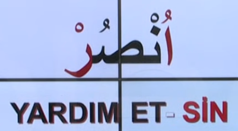
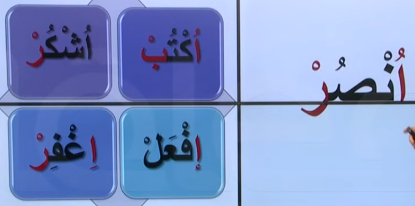
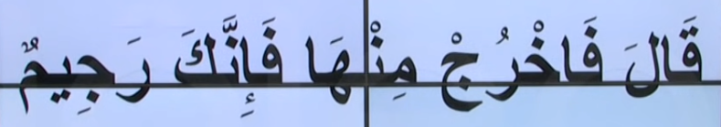
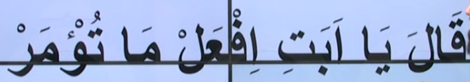

# 10. Ders

`Emsileyi muhtefile`'den devam edelim.

## Emsileyi Muhtelife

`Muhtelife` icindeki 24 sigayi ezberleyerek gidecegiz.

### Emri Hazir

- Yanimizdaki kisiler icin emir kelimesi.
- `Fiili muzari`nin ilk harfi kaldirilir, basina `hemze` getirilir. `Fiil-i muzari`'nin sondan bir onceki harekesi `ustun` ise ya da `esre` ise `hemze`'nin harekesi `kesre`li olur. Eger sondan bir onceki harfin harekesi `merfu` ise `hemze`'nin harekesi de `merfu` olur.

Asagidaki ayetleri inceleyelim. Bildigimiz bir sey var mi?

