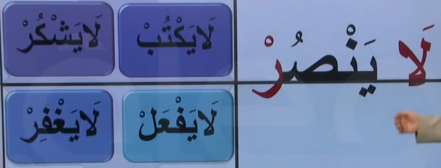

# 11. Ders

`Emsileyi muhtefile`'den devam edelim.

## Emsileyi Muhtelife

`Muhtelife` icindeki 24 sigayi ezberleyerek gidecegiz.

### Nehy-i Gaib

- Ucuncu sahis icin olumsuz emir kelimesi.
- `Fiili muzari`nin basina `la` harfi getirilir, sonu `cezm` edilir.

Asagidaki ayet'i inceleyelim. Bildigimiz bir sey var mi?

