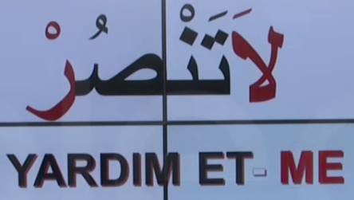
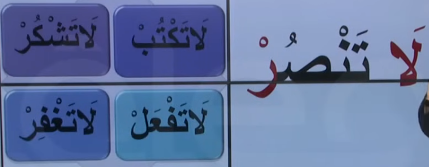
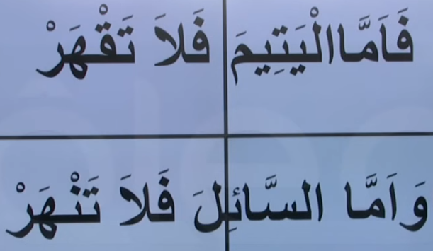

# 12. Ders

`Emsileyi muhtefile`'den devam edelim.

## Emsileyi Muhtelife

`Muhtelife` icindeki 24 sigayi ezberleyerek gidecegiz.

### Nehy-i Hazir

- Yanimizdaki kisiler icin olumsuz emir kipi.
- `Fiili muzari`nin basina `la` harfi getirilir, sonu `cezm` edilir.
- `Fiili muzari`'nin basindaki `ye` harfi `te` harfine cevrilir.

Asagidaki ayet'i inceleyelim. Bildigimiz bir sey var mi?

