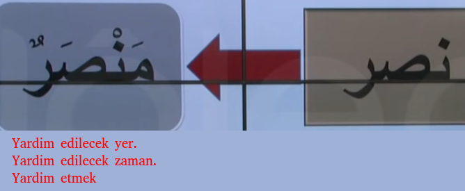

# 13. Ders

`Emsileyi muhtefile`'den devam edelim.

## Emsileyi Muhtelife

`Muhtelife` icindeki 24 sigayi ezberleyerek gidecegiz.

### Ism-i Zaman, Ism-i Mekan ve Mastar Mim'i

- `Ism-i zaman` fiil'in yapildigi zaman, yani yardim edecek/edilen zaman manasina gelir.
- `Ism-i mekan` fiil'in yapildigi mekan, yani yardim edecek/edilen yer manasina gelir.
- `Mastar mim'i` basinda `mim` bulunan mastar demektir. Yardim etmek manasina gelir.
- Asagidaki ornek gibi yapilir.

