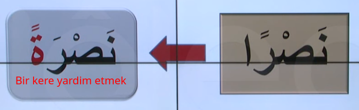
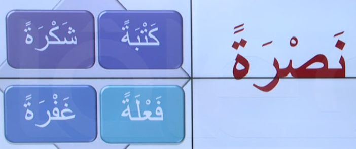
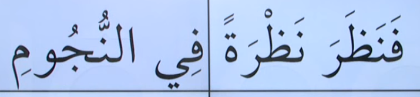

# 15. Ders

`Emsileyi muhtefile`'den devam edelim.

## Emsileyi Muhtelife

`Muhtelife` icindeki 24 sigayi ezberleyerek gidecegiz.

### Masdar Bina-i Merre

- `Kemmiyet`'e yani sayiya delalet eden mastardir. Bir eylemin kac defa yapildigini bildirmek icin kullanilir.
- Bir kere yardim etmek manasina gelir.
- Asagidaki gibi yapilir

Asagidaki ayet'i inceleyelim. Bildigimiz bir sey var mi?

