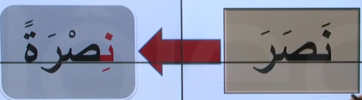
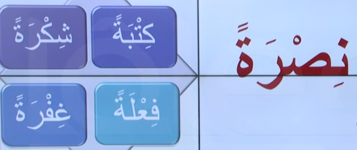
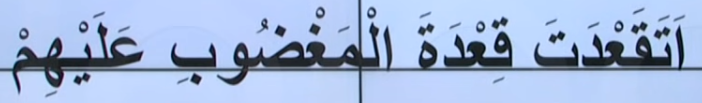

# 16. Ders

`Emsileyi muhtefile`'den devam edelim.

## Emsileyi Muhtelife

`Muhtelife` icindeki 24 sigayi ezberleyerek gidecegiz.

### Masdar Bina-i Nevi

- `Keyfiyyet`'e yani sekle (cesite) delalet eden mastardir. Bir eylemin nasil yapildigini bildirmek icin kullanilir.
- Bir cesit / bir sekilde yardim etmek manasina gelir. (Farkli bir tarz yardim etmek, kendine has bir tarzla yardim etmek.)
- Asagidaki gibi yapilir

Asagidaki hadis'i serif'i inceleyelim. Bildigimiz bir sey var mi?

