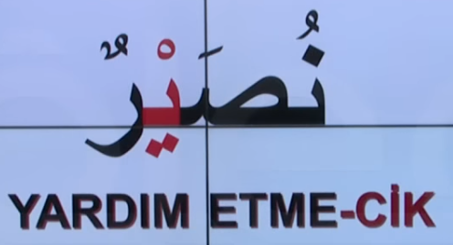
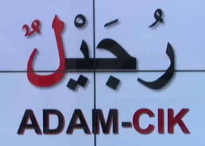
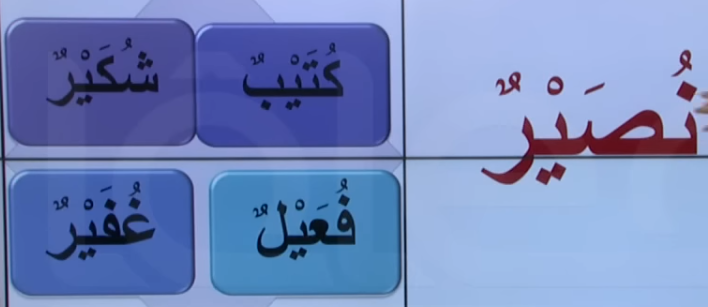
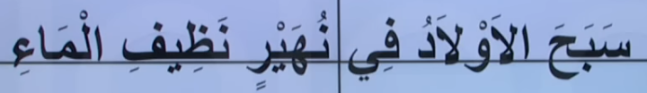
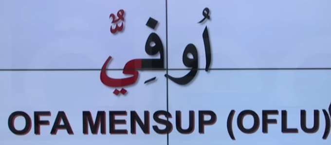
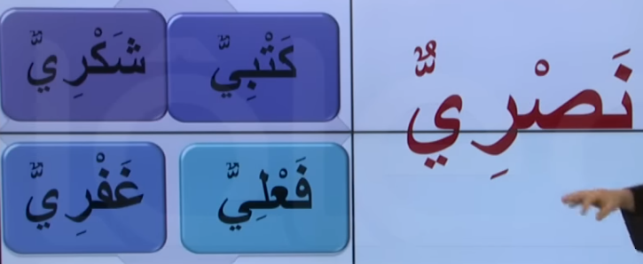

# 17. Ders

`Emsileyi muhtefile`'den devam edelim.

## Emsileyi Muhtelife

`Muhtelife` icindeki 24 sigayi ezberleyerek gidecegiz.

### Ism-i Tasgir

- Kucukluk ve azlik ifade etmek, sevgi gostermek ve hor gormek icin kullanilan isimdir.
- Ucuncu harf yerine `zaid` bir `tasgir ye`'si getirilerek yapilir.

Asagidaki cumle'yi inceleyelim. Bildigimiz bir sey var mi?

### Ism-i Mensub

- Bir yere, aileye, meslege veya herhangi bir seye mensub olmayi bildirir, o isle meshur olmayi bildirir. Ornek: Mesela ne is yapiyorsun sorusuna ketbiyyun diye cevap verilebilir. Yazma isine mensubum, o is ile mesgul oluyorum manasina gelmis olur.
- Sonuna `makabli kesrali seddeli bir ye` harfi getirilerek yapilir.

