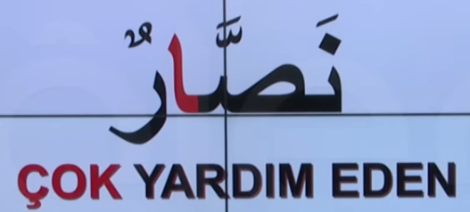
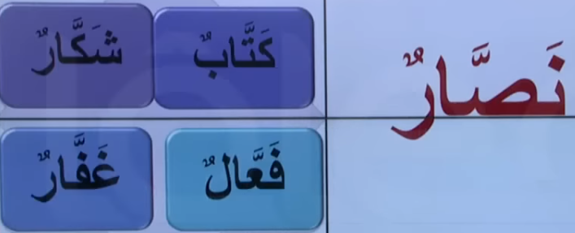
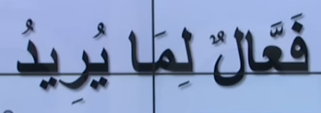
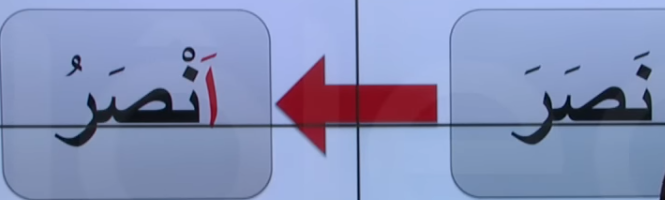
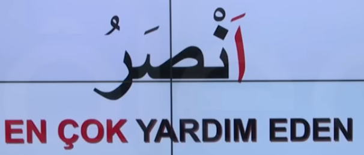
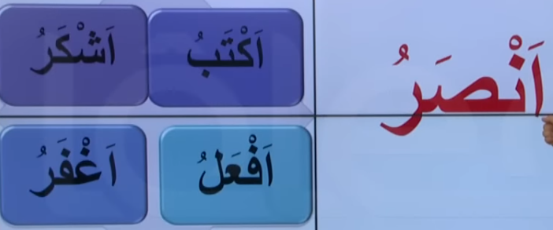
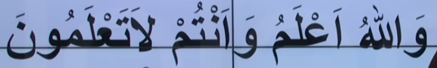

# 18. Ders

`Emsileyi muhtefile`'den devam edelim.

## Emsileyi Muhtelife

`Muhtelife` icindeki 24 sigayi ezberleyerek gidecegiz.

### Mubalagali Ism-i Fail

- Fiil'in mubalaga ile kaim oldugu sahsa veya isme delalet eden fiildir.
- Fiil'in ikinci harfi `sedde` olur ve sonuna elif gelir.

Asagidaki ayet'i kerime'yi inceleyelim. Bildigimiz bir sey var mi?

### Ism-i Tafdil

- Iki seyden birininin digerinden mutlak oldugunu soylerken kullanilir. Ya da bir seyin en ustun oldugunu soylerken kullanilir.
- Asagidaki gibi yapilir.

Asagidaki ayet'i kerime'yi inceleyelim. Bildigimiz bir sey var mi?

