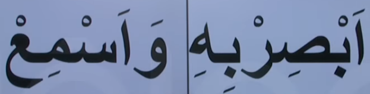

# 19. Ders

`Emsileyi muhtefile`'den devam edelim.

## Emsileyi Muhtelife

`Muhtelife` icindeki 24 sigayi ezberleyerek gidecegiz.

### Fiil-i Taaccub-u Evvel

- Bir sey karisinda duyulan saskinligi ifade eden fiildir.
- Asagidaki gibi yapilir

Asagidaki ayet'i kerime'yi inceleyelim. Bildigimiz bir sey var mi?

### Fiil-i Taaccub-u Sani

- Bir sey karisinda duyulan saskinligi ifade eden fiildir. `Fiil-i Taaccub-u Evvel`'den daha buyuk bir saskinlik ifade eder.
- Asagidaki gibi yapilir.

Asagidaki ayet'i kerime'yi inceleyelim. Bildigimiz bir sey var mi?

