# 2. Ders

`Emsileyi muhtefile`'den devam edelim.

## Emsileyi Muhtelife

`Muhtelife` icindeki 24 sigayi ezberleyerek gidecegiz.

### Fiil-i Mazi

- Gecmis zamanda var olan bir isi bildiren kelimedir.
- Ilk harfi ve son harfi `fethali` okunur. Yani `ustun` olur.

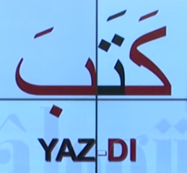

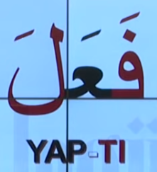

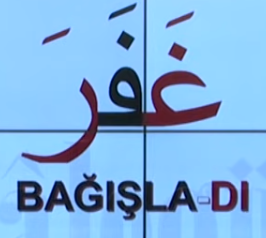

- Allah'u Teala bagisladi (gaferallahu)

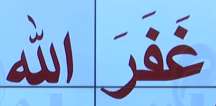

- Ogrenci yazdi

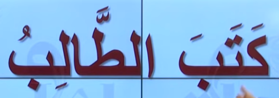

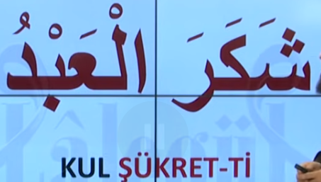

Asagidaki ayet'i inceleyelim. Bildigimiz bir sey var mi?

### Fiil-i Muzari

- Simdiki zaman, genis zaman ya da gelecek zamanda bir isin olusunu bildiren siga'dir.
- Genellikle simdiki zaman icin kullanilir.
- Sondan bir onceki harfi degisebilir.

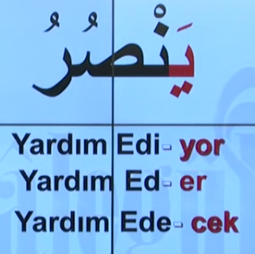

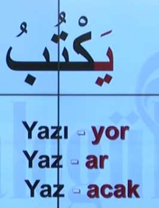

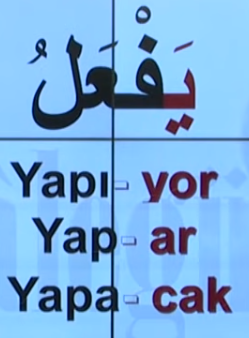

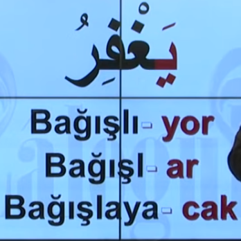

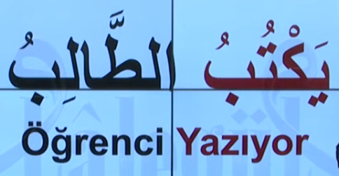

Asagidaki ayet'i inceleyelim. Bildigimiz bir sey var mi?

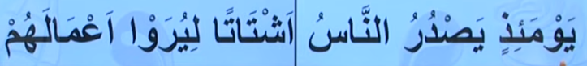
