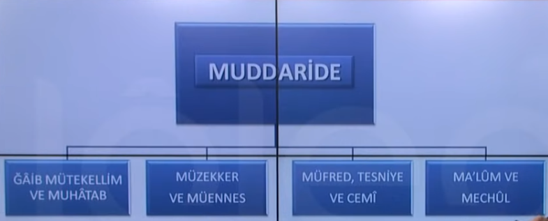
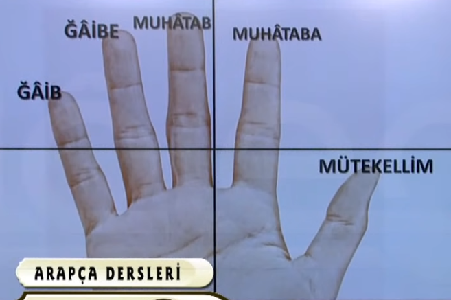
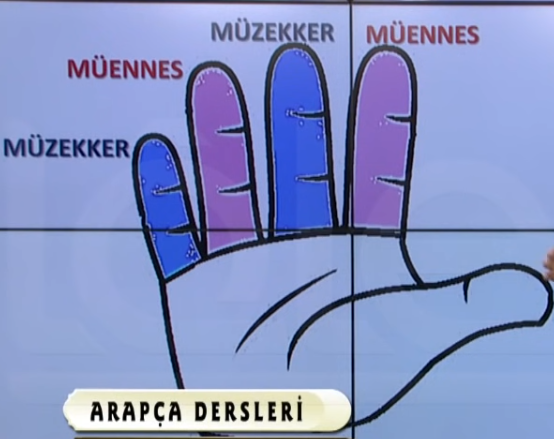
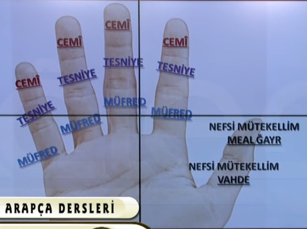
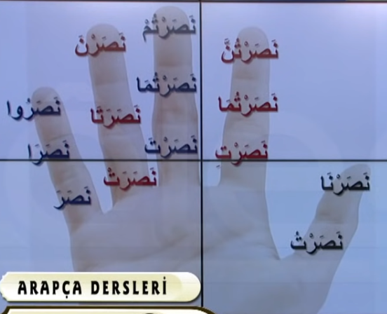
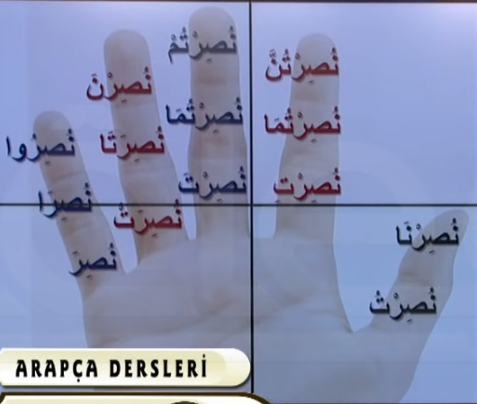

# 20. Ders

`Emsileyi muddaride`'ye basliyoruz.

## Emsileyi Muddaride

`Muhtelife` icinde ogrendimiz sigalarin detayli cekimlerini yapacagiz. Yapan o mu, sen mi, ben miyim? Erkek mi yoksa kadin mi? Bir kisi mi, iki kisi mi yoksa cok kisi mi?

Icinde 4 kisim inceleme yapacagiz.

Bu 4 kismi sag elimizin cesitli yerlerine yerlestirip ogrenmeye calisacagiz.

### Gaib, Muhatab ve Mutekellim

- `Gaib` 3. sahistir. (O, onlar)
- `Muhatab` 2. sahistir. (Sen, siz)
- `Mutekellim` 1. sahistir. (Ben, biz)

### Muzekker ve Muennes

- `Muzekker` erkek demektir.
- `Muennes` kadin demektir.

### Mufred, Tesniye ve Cemi

- `Mufred` tekil demektir.
- `Tesniye` iki kisilik coguldur.
- `Cemi` ikiden fazla kisilik coguldur.
- `Nefsi mutekellim vahde`, ben demektir.
- `Nefsi mutekellim meal gayr` biz demektir.

### Malum ve Mechul

- `Malum` etken demektir.
- `Mechul` edilgen demektir.

`Malum` ve `Mechul`'u parmaklara yerlestirmeden yapacagiz.

### Fiil-i Mazi

#### Malum

#### Mechul

