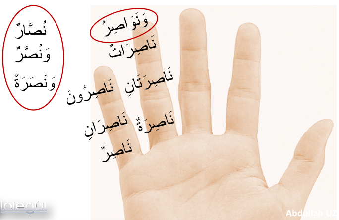
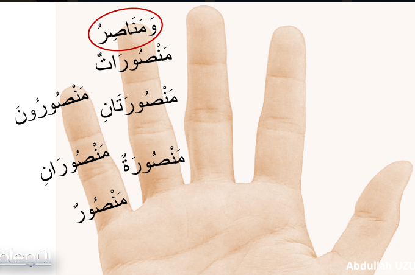
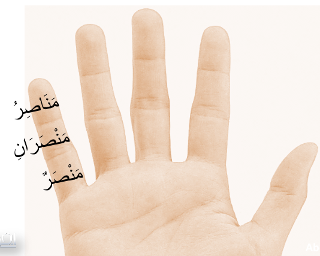

# 25. Ders

`Emsileyi muddaride`'den devam edelim.

## Emsileyi Muddaride

Onceki derslerimizde fiileri bitirdik. Bu dersten itibaren `Emsileyi muddaride`'nin isim cekimlerine geciyoruz.

Isimlerde `malum` ve `mechul` ya da `gaib` ve `muhatab` olarak incelenmez. Isimlerde bu durumlardar soz edemeyiz.

Bazi sigalarin `cemi` cekimlerinin `cemi mukesser`leri yani turkce ifade ile `kirik cemi`'leri oldugunu gorecegiz. Bunlar bir kaliba uymayan cemi sigalaridir. Bildigimiz cemi ile ayni manaya gelirler. Ayrica ezberlememiz gerekir.

### Mastar

`Emsileyi muddaride` cekimi yoktur.

### Ism-i Fail

### Ism-i Meful

### Ism-i Zaman, Ism-i Mekan, Mastar Mim'i

