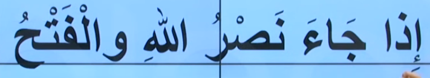

# 3. Ders

`Emsileyi muhtefile`'den devam edelim.

## Emsileyi Muhtelife

`Muhtelife` icindeki 24 sigayi ezberleyerek gidecegiz.

### Mastar

- Butun kelimeler mastardan turemistir.
- Turkcedeki mek li mak li kelimelerin karsiligidir.
- Mastarlarin kurali yoktur. `Semai` dir. `Semai` duymaktan gelir. Araplardan duyuldugu sekilde ezberlenir.

Asagidaki ayet'i inceleyelim. Bildigimiz bir sey var mi?

Yukarida `feth` ve `nasr` gorebiliriz.

### Ism-i Fail

- Fiili meydana getiren kisi demektir.

Asagidaki ayet'i inceleyelim. Bildigimiz bir sey var mi?

### Ism-i Mef'ul

- Yapilan is demektir. Failin yaptigi isten etkileneni ifade eder.

Asagidaki ayet'i inceleyelim. Bildigimiz bir sey var mi?

