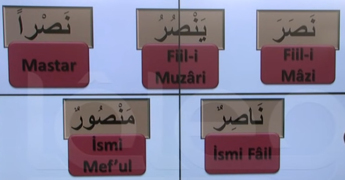
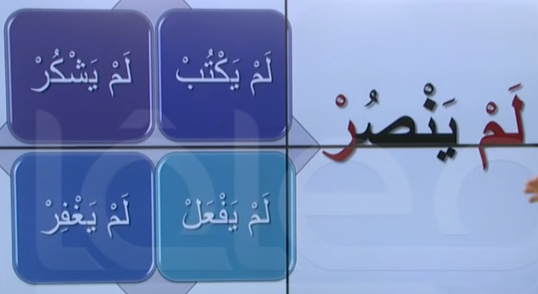

# 4. Ders

`Emsileyi muhtefile`'den devam edelim.

## Emsileyi Muhtelife

`Muhtelife` icindeki 24 sigayi ezberleyerek gidecegiz.

### Tum Cekimlerde Tum Harfler Bulunur

Su ana kadar yaptigimiz cekimlerde ve sonrasinda aslinda kelimenin kendisinin her zaman cekimli halinde de bulundugunu goruruz.

Mesela `nasran` icin tum cekimlerde icinde `nun`, `sad` ve `ra` harfleri bulunur.

### Cahdi Mutlak

- Olumsuz gecmis zamani ifade eder.

#### Lem

`Cahdi mutlak` `lem`'in bir `fiil-i muzari` ile bitismesi ile olur ve bu durum 3 degisiklige sebep olur.

1. Zamani gecmis zamana cevirir.
2. Olumsuzluk manasi katar.
3. Dahil oldugu `muzari`'nin son harfini `cezm` eder.

#### Ornekler

Asagidaki ayet'i inceleyelim. Bildigimiz bir sey var mi?

