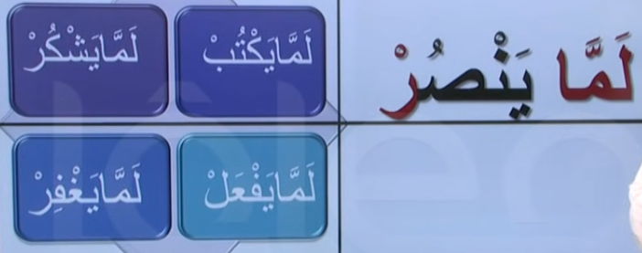
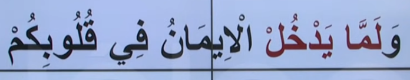

# 5. Ders

`Emsileyi muhtefile`'den devam edelim.

## Emsileyi Muhtelife

`Muhtelife` icindeki 24 sigayi ezberleyerek gidecegiz.

### Cahdi Mustagrak

- Ayni `lem` gibidir.
- Lem yerine `Lemma` kullanilir.
- Henuz yardim etmedi ama yardim edebilir, yardim etme firsati anlamina gelir.

> Bir ders var. Bir ogrenci bu derse girmedi. Dersin ortasinda ogretmen soruyor. Falanca kisi nerede? Ogrenciler cevap veriyor `Lemmayedhul`. Henuz derse girmedi ama girme firsati var cunku ders bitmedi. Daha sonra ders bitince mudur soruyor ogretmene falan kisi nerede? Ogretmen cevap veriyor `Lemyedhul`. Derse girmedi.

Asagidaki ayet'i inceleyelim. Bildigimiz bir sey var mi?

