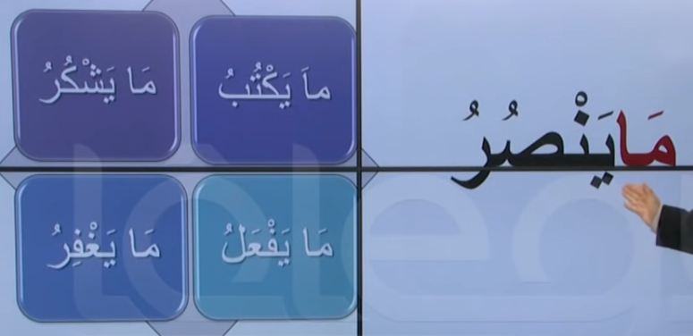
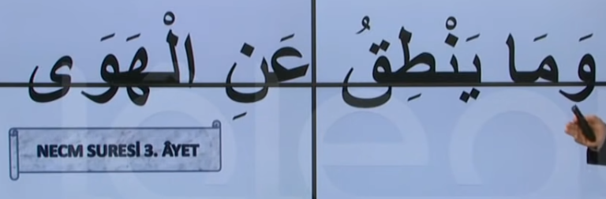

# 6. Ders

`Emsileyi muhtefile`'den devam edelim.

## Emsileyi Muhtelife

`Muhtelife` icindeki 24 sigayi ezberleyerek gidecegiz.

### Nefi Hal

- Olumsuz simdiki zaman.
- Fiili muzarinin basina `ma` harfi gelir.

Asagidaki ayet'i inceleyelim. Bildigimiz bir sey var mi?

