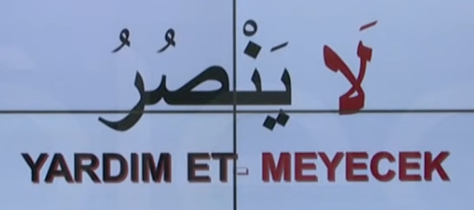
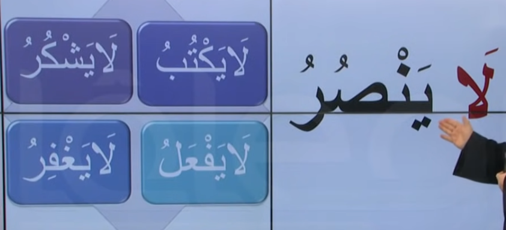
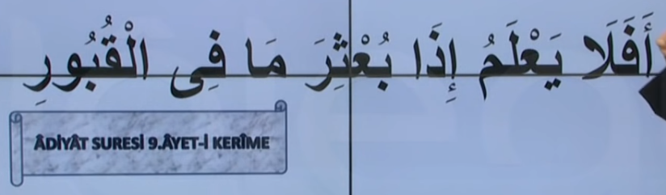

# 7. Ders

`Emsileyi muhtefile`'den devam edelim.

## Emsileyi Muhtelife

`Muhtelife` icindeki 24 sigayi ezberleyerek gidecegiz.

### Nefi Istikbal

- Olumsuz gelecek zaman.
- Fiili muzarinin basina `la` harfi gelir.
- Yardim etmeyecek manasina gelse de Arapca'da gelecek zaman ile birlikte genis zaman olarak da kullanilir

Asagidaki ayet'i inceleyelim. Bildigimiz bir sey var mi?

