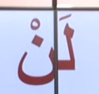
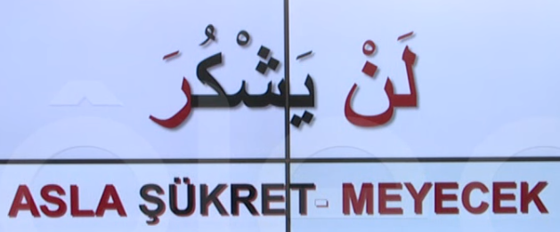
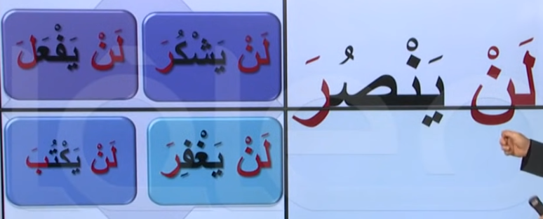
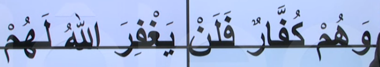

# 8. Ders

`Emsileyi muhtefile`'den devam edelim.

## Emsileyi Muhtelife

`Muhtelife` icindeki 24 sigayi ezberleyerek gidecegiz.

### Tekidi Nefi Istikbal

- Olumsuz tekitli (kuvvetlendirilmis) gelecek zaman.
- Yardim etmeyecek (ve kesinlikle) manasina gelir

#### Len

`Tekidi Nefi Istikbal` `len`'in bir `fiil-i muzari` ile bitismesi ile olur ve bu durum 3 degisiklige sebep olur.

1. Zamani gelecek zamana cevirir.
2. Tekitli olumsuzluk manasi katar.
3. `Fiil'i muzari`'nin sonunu `nasb` eder yani `ustun` yapar.

#### Ornekler

Asagidaki ayet'i inceleyelim. Bildigimiz bir sey var mi?

