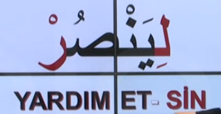
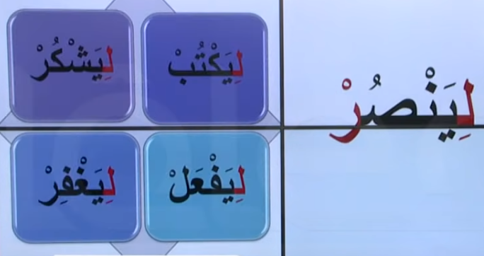
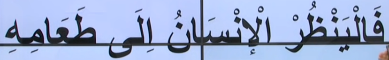

# 9. Ders

`Emsileyi muhtefile`'den devam edelim.

## Emsileyi Muhtelife

`Muhtelife` icindeki 24 sigayi ezberleyerek gidecegiz.

### Emr-i Gaib

- Bu kalip 3. tekil sahisa emir verirken kullanilir.
- `Fiil'i muzari`'nin basina `kesreli` `lam` harfi getirilerek yapilir.
- Sonunu `cezm` eder.

#### Ornekler

Asagidaki ayet'i inceleyelim. Bildigimiz bir sey var mi?

